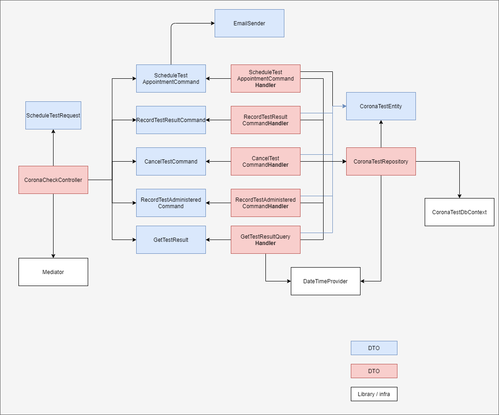

This repository contains some examples on testing practices.

The goal is to demonstrate how the overuse of mocking libraries makes for brittle tests. Note, while I'm demonstrating some **testing** 
practices here, it's not meant as an example on how to build software. 

I've deliberately added some coding styles I see in the wild (such as the use of a mediator). These practices likely don't make much sense
for an application this scale. 

There are two solutions here. 

CoronaTestSystem.sln (with mocks)

CoronaTestSystem.mockless.sln (without mocks)

This is a (example) system to schedule corona testing appointments with the following (partly implemented) functionality:
1. Schedule tests
2. Administer tests
3. Record test results

The architecture is as follows. 

